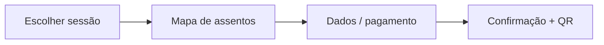

# Portal do Cinema — Planejamento do frontend

Base: projeto Stitch **Portal do Cinema** (`3154062614796903639`), unidade **Cine São José**.

Stack alvo: **Next.js (App Router)** + **Tailwind CSS** + TypeScript.  
Assets de referência: `stitch-downloads/` (gerados por `npm run fetch:stitch`).

---

## 1. Telas Stitch → rotas da aplicação

| Stitch | Screen ID | Rota Next.js | Página |
|--------|-----------|--------------|--------|
| Home - Cine São José | `f7625b76719d4396ba6445eda972b431` | `/` | Landing do cinema: destaque, sessões do dia, CTA programação |
| Programação - Cine São José | `167f31e6a40b4e779eca25c9f7ffefdc` | `/programacao` | Sessões por data e horário (tela 2D única) |
| Detalhes do Filme - Cine São José | `9c5bd8111abb43e9abd3f35acfdd854e` | `/filme/[slug]` | Sinopse, trailer, classificação, horários |
| Comprar Ingresso - Cine São José | `9dc17d80e7274cfb97574b551e292a93` | `/ingressos/comprar` | Fluxo: sessão → assentos → pagamento → confirmação |
| Design System | `asset-stub-assets-…` | — (interno) | Tokens: cores, tipografia, botões, cards |

Slug do filme derivado do título ou ID da API backend (Pajeu Ticket).

---

## 2. Estrutura de pastas (proposta)

```
src/
  app/
    layout.tsx              # fontes, tema, header/footer globais
    page.tsx                # Home
    programacao/page.tsx
    filme/[slug]/page.tsx
    ingressos/
      comprar/page.tsx
      confirmacao/page.tsx
  components/
    layout/                 # Header, Footer, navegação
    home/                   # Hero, Destaques, SessoesHoje
    programacao/            # Filtros, ListaSessoes, CardFilme
    filme/                  # Poster, Sinopse, ListaHorarios
    ingressos/              # Stepper, MapaAssentos, ResumoPedido
    ui/                     # Button, Badge, Modal (do design system)
  lib/
    api/                    # cliente HTTP → API Pajeu Ticket
    stitch/                 # parser de tokens extraídos do HTML Stitch (opcional)
  styles/
    globals.css             # @tailwind + variáveis CSS do design system
```

---

## 3. Componentes compartilhados (extraídos do Design System)

Após o download do Stitch, mapear em `stitch-downloads/design-system/`:

- **Cores**: primária, fundo escuro/claro, texto, estados (hover, disabled)
- **Tipografia**: títulos, corpo, labels de sessão
- **Botões**: primário (comprar ingresso), secundário, ghost
- **Cards**: filme em cartaz, sessão na grade
- **Header**: logo Cine São José, links (Home, Programação), ícone carrinho/ingressos

Implementação: variáveis em `tailwind.config.ts` espelhando o HTML do design system.

---

## 4. Fluxo “Comprar ingresso” (estado e etapas)



- Estado global: Context ou Zustand (`useCheckout`)
- Query params: `?sessaoId=` ao entrar a partir de Detalhes do Filme
- Integração futura: API de reservas, pagamento (PIX/cartão) — fora do escopo Stitch

---

## 5. Integração com o backend (Pajeu-Ticket-API)

Base: `NEXT_PUBLIC_API_URL` (padrão `http://localhost:8080`)

| Tela | Endpoint |
|------|----------|
| Home | `GET /filmes`, `GET /sessoes` |
| Programação | `GET /sessoes` |
| Detalhes do filme | `GET /filmes` (slug), `GET /sessoes` (filtro por filme) |
| Comprar ingresso | `GET /sessoes/{id}`, `POST /vendas-ingresso/registrar` |

Cliente: `src/lib/api/*`. Rotas públicas no backend (GET catálogo + POST venda) com CORS para `localhost:3000`.

Reinicie a API após alterações em `SecurityConfig` / `CorsConfig`.

---

## 6. i18n e conteúdo

- UI em **português (pt-BR)** conforme pedido no projeto Stitch
- Metadados SEO por página (`generateMetadata` no App Router)
- Acessibilidade: foco visível, `aria-*` nos steps de compra e no mapa de assentos

---

## 7. Próximos passos

1. **Autenticação Stitch**: exportar `STITCH_API_KEY` e rodar `npm run fetch:stitch`
2. Revisar `stitch-downloads/*/code.html` e `screen.png` por tela
3. Extrair tokens do design system → `tailwind.config.ts`
4. `create-next-app` com TypeScript + Tailwind + App Router
5. Implementar layout + Home usando componentes alinhados ao HTML Stitch
6. Demais rotas na ordem: Programação → Detalhes → Comprar ingresso

---

## 8. Comando de download

```bash
export STITCH_API_KEY="sua-chave"   # stitch.withgoogle.com → Settings → API Key
npm run fetch:stitch
```

OAuth alternativo: token válido em `~/.gemini/oauth_creds.json` + `GOOGLE_CLOUD_PROJECT=<projeto-gcp>`.
